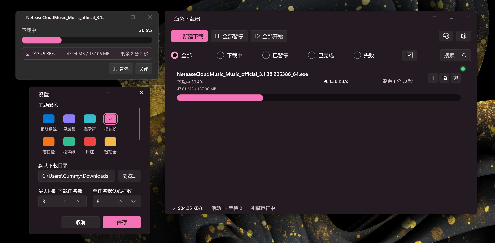

# 海兔下载器

一款基于 Aria2 引擎的 Windows 下载工具。点击浏览器里的下载链接，文件就会自动交给桌面客户端进行多线程高速下载。



**它能做什么：**

- 浏览器里点击下载，自动交给桌面客户端处理
- Aria2 多线程引擎，支持断点续传
- 内置多种主题配色，支持深色模式
- 小巧的独立进度浮窗，不影响你做别的事
- 下载完成弹通知，一键打开所在文件夹
- 系统托盘常驻，随时查看下载进度

---

### 常用快捷键

- **双击任务文件名**：在资源管理器里打开文件所在位置并选中该文件
- **托盘单击**：唤出主窗口
- **右键托盘图标**：快捷菜单

---

## 开发者指南

### 软件架构

海兔下载器分为三个部分：

```
┌─────────────────┐     HTTP/WebSocket      ┌─────────────────────┐
│  浏览器扩展     │  ═══════════════════════► │  桌面客户端 (WinUI3) │
│  (Manifest V3)  │     (本地 API + 密钥)    │  .NET 8 + WASDK     │
└─────────────────┘                         └──────────┬──────────┘
                                                       │
                                            JSON-RPC over localhost
                                                       │
                                              ┌────────┴────────┐
                                              │   Aria2 引擎    │
                                              │  (aria2c.exe)   │
                                              └─────────────────┘
```

- **浏览器扩展**：拦截浏览器的 `downloads` 事件，通过 HTTP 把下载请求发给桌面客户端。Manifest V3，纯原生 JS，无构建步骤。
- **桌面客户端**：WinUI 3 桌面应用，负责 UI、任务管理、系统通知、托盘图标。内部同时运行一个本地 HTTP API 服务器，接收扩展请求。
- **Aria2 引擎**：独立的 aria2c 进程，通过 JSON-RPC 协议被客户端调用，真正执行多线程下载。

### 技术实现

| 组件 | 技术栈 |
|------|--------|
| 桌面客户端 | C# / .NET 8 / WinUI 3 / Windows App SDK |
| 浏览器扩展 | JavaScript / Manifest V3 |
| 下载引擎 | Aria2 (GPL v2) |
| 客户端 ↔ 扩展 | HTTP REST API，本地回环地址，带密钥鉴权 |
| 客户端 ↔ Aria2 | JSON-RPC over WebSocket |

### 目录结构

```
├── src/
│   ├── KokonaDownloader.App/         WinUI 3 桌面客户端
│   ├── KokonaDownloader.Core/        核心库：Aria2 封装、设置、计划、通知
│   └── KokonaDownloader.Core.Tests/  单元测试
├── extension/                        浏览器扩展源码（直接加载即可用）
├── vendor/aria2/                     Aria2 引擎二进制
├── screenshot/                       产品截图
├── icons/                            应用图标
├── build.ps1                         一键构建脚本
└── README.md                         本文档
```

### 本地构建

需要 [.NET 8 SDK](https://dotnet.microsoft.com/download)。

```powershell
# 一键构建（客户端 + 扩展）
powershell -ExecutionPolicy Bypass -File .\build.ps1

# 产物：
#   dist\KokonaDownloader\KokonaDownloader.exe   桌面客户端
#   dist\KokonaExtension\                        浏览器扩展目录
```

浏览器扩展无需构建，直接把 `extension/` 目录或 `dist\KokonaExtension\` 加载到浏览器即可。

---

## 开源协议

本项目采用 **MIT 协议** 开源。

> 注意：软件内置的 Aria2 下载引擎（`vendor/aria2/aria2c.exe`）是独立的第三方组件，遵循其自身的 [GPL v2](https://github.com/aria2/aria2/blob/master/COPYING) 许可证。海兔下载器通过 JSON-RPC 协议与 Aria2 进程通信，两者在许可证层面相互独立。
