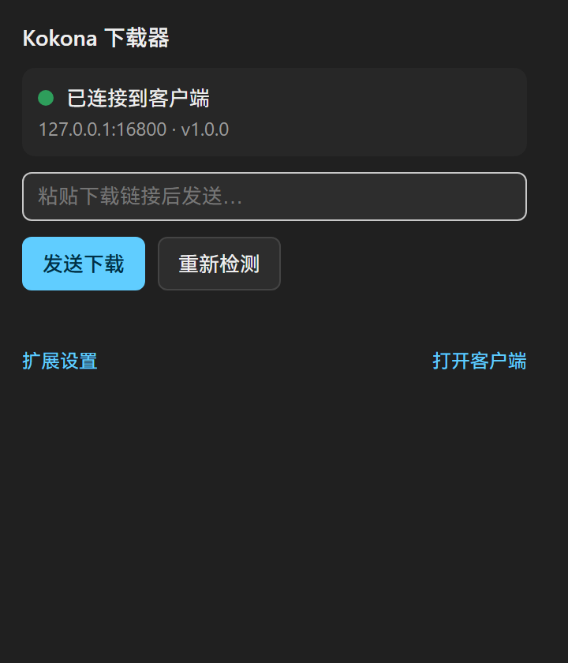
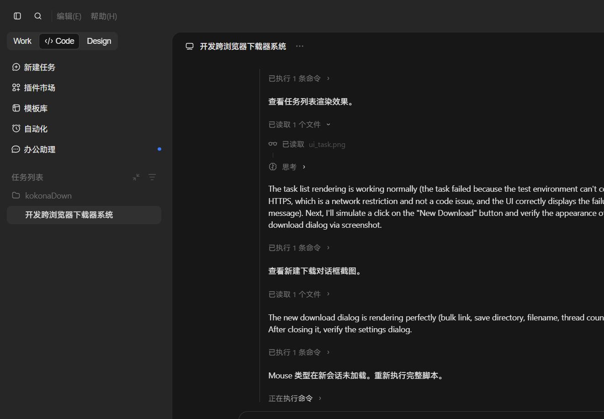
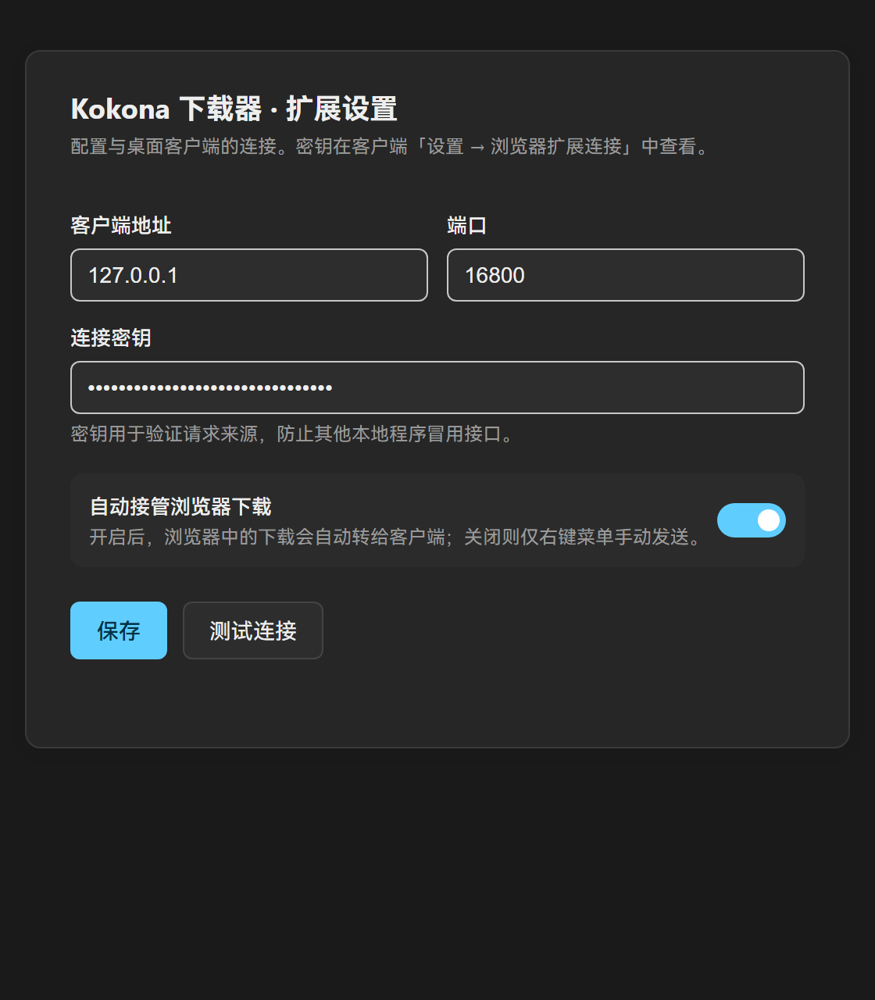
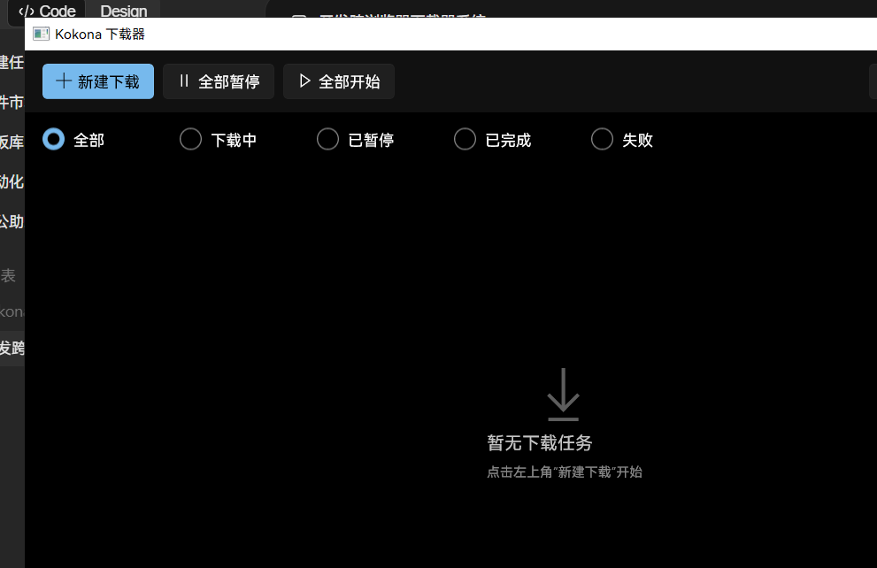

# 海兔下载器

一款基于 Aria2 引擎的 Windows 下载工具。点击浏览器里的下载链接，文件就会自动交给桌面客户端进行多线程高速下载。


**它能做什么：**

- 浏览器里点击下载，自动交给桌面客户端处理
- Aria2 多线程引擎，支持断点续传
- 内置多种主题配色，支持深色模式
- 小巧的独立进度浮窗，不影响你做别的事
- 下载完成弹通知，一键打开所在文件夹
- 系统托盘常驻，随时查看下载进度

---

## 快速开始

### 第一步：下载并运行桌面客户端

1. 在 [Releases](../../releases) 页面下载最新版 `KokonaDownloader.zip`，解压到任意文件夹
2. 双击 `KokonaDownloader.exe` 运行
3. 首次运行会在后台创建配置文件，无需额外设置

> 软件需要 Windows 10 1809 或 Windows 11 系统。

### 第二步：在 Edge 浏览器里安装扩展

海兔下载器需要搭配浏览器扩展才能接管下载。下面是在 Edge 里安装扩展的方法：

#### 1. 打开扩展管理页面

在 Edge 地址栏输入下面这串地址，然后按回车：

```
edge://extensions/
```

#### 2. 打开「开发人员模式」

在扩展管理页面的**左下角**，把「开发人员模式」开关打开。

#### 3. 加载扩展

点击页面上出现的「加载解压缩的扩展」按钮，在弹出的文件夹选择窗口中，选中解压出来的 `KokonaExtension` 文件夹。



加载成功后，Edge 工具栏上会出现海兔下载器的小图标。

### 第三步：把密钥从客户端粘贴到扩展里（最关键的一步）

这一步不做，扩展和客户端就是「各干各的」，没法配合工作。

#### 在桌面客户端里找到密钥

打开海兔下载器，点击右上角的 **⚙ 设置** 按钮，找到「浏览器扩展」区域。你会看到一段类似 `a1b2c3d4...` 的密钥，旁边有个「复制」按钮，点一下把它复制到剪贴板。



#### 把密钥填进扩展

点击浏览器工具栏上的海兔下载器图标，在弹出的面板里点击「扩展设置」，把刚才复制的密钥粘贴到「密钥」输入框里。地址和端口保持默认（`127.0.0.1` 和 `16800`）不用改，点「保存」。



#### 确认连接成功

如果扩展图标变成 **绿色对勾**，说明已经和桌面客户端连上了。如果是红色感叹号，检查客户端有没有打开，或者密钥有没有复制完整（建议直接点「复制」按钮，不要手打）。

### 第四步：开始使用

连接成功后，你在浏览器里点任何下载链接，扩展都会自动把任务发给桌面客户端下载，同时取消浏览器自己的下载。

也可以右键点击链接或图片，选择「使用海兔下载器下载」。



---

## 功能介绍

| 功能 | 说明 |
|------|------|
| **新建下载** | 粘贴 URL 即可下载，支持批量粘贴多个链接 |
| **暂停/继续/删除** | 随时控制下载任务 |
| **进度浮窗** | 每个下载任务会弹出独立小窗显示速度和剩余时间 |
| **主题配色** | 设置里可以换颜色，有樱花粉、海雾青、星岚紫等多种配色 |
| **下载计划** | 可以设置全部下载完成后自动关机或退出软件 |
| **限速** | 不想下载占满带宽？在设置里调一下就行 |
| **开机自启** | 设置里勾选，下次开机自动运行 |
| **托盘图标** | 关闭窗口不会退出，会在托盘常驻，图标上的进度环实时显示整体下载进度 |

### 常用快捷键

- **双击任务文件名**：在资源管理器里打开文件所在位置并选中该文件
- **托盘单击**：唤出主窗口
- **右键托盘图标**：快捷菜单

---

## 常见问题

**Q：扩展一直显示「客户端未运行」**
> 先确认 `KokonaDownloader.exe` 已经打开。然后检查扩展设置里的地址和端口是否跟客户端设置里显示的一致。

**Q：提示「密钥错误」**
> 密钥必须跟客户端设置里显示的**完全一致**。建议直接用客户端里的「复制」按钮，然后粘贴到扩展里，不要手打，避免多空格或少字符。

**Q：想临时恢复浏览器自带的下载**
> 打开扩展设置，把「自动接管浏览器下载」关掉即可。需要时再打开。

**Q：端口被其他程序占用了**
> 打开 `%APPDATA%\KokonaDownloader\settings.json`，把 `ApiPort` 改成别的数字（比如 16802），保存后重启客户端，同时在扩展设置里也把端口改成一样的。

**Q：下载的文件在哪？**
> 默认在「下载」文件夹。可以在客户端设置里修改默认下载目录。

---

## 开发者指南

### 软件架构

海兔下载器分为三个部分：

```
┌─────────────────┐     HTTP/WebSocket      ┌─────────────────────┐
│  浏览器扩展     │  ═══════════════════════► │  桌面客户端 (WinUI3) │
│  (Manifest V3)  │     (本地 API + 密钥)    │  .NET 8 + WASDK     │
└─────────────────┘                         └──────────┬──────────┘
                                                       │
                                            JSON-RPC over localhost
                                                       │
                                              ┌────────┴────────┐
                                              │   Aria2 引擎    │
                                              │  (aria2c.exe)   │
                                              └─────────────────┘
```

- **浏览器扩展**：拦截浏览器的 `downloads` 事件，通过 HTTP 把下载请求发给桌面客户端。Manifest V3，纯原生 JS，无构建步骤。
- **桌面客户端**：WinUI 3 桌面应用，负责 UI、任务管理、系统通知、托盘图标。内部同时运行一个本地 HTTP API 服务器，接收扩展请求。
- **Aria2 引擎**：独立的 aria2c 进程，通过 JSON-RPC 协议被客户端调用，真正执行多线程下载。

### 技术实现

| 组件 | 技术栈 |
|------|--------|
| 桌面客户端 | C# / .NET 8 / WinUI 3 / Windows App SDK |
| 浏览器扩展 | JavaScript / Manifest V3 |
| 下载引擎 | Aria2 (GPL v2) |
| 客户端 ↔ 扩展 | HTTP REST API，本地回环地址，带密钥鉴权 |
| 客户端 ↔ Aria2 | JSON-RPC over WebSocket |

### 目录结构

```
├── src/
│   ├── KokonaDownloader.App/         WinUI 3 桌面客户端
│   ├── KokonaDownloader.Core/        核心库：Aria2 封装、设置、计划、通知
│   └── KokonaDownloader.Core.Tests/  单元测试
├── extension/                        浏览器扩展源码（直接加载即可用）
├── vendor/aria2/                     Aria2 引擎二进制
├── screenshot/                       产品截图
├── icons/                            应用图标
├── build.ps1                         一键构建脚本
└── README.md                         本文档
```

### 本地构建

需要 [.NET 8 SDK](https://dotnet.microsoft.com/download)。

```powershell
# 一键构建（客户端 + 扩展）
powershell -ExecutionPolicy Bypass -File .\build.ps1

# 产物：
#   dist\KokonaDownloader\KokonaDownloader.exe   桌面客户端
#   dist\KokonaExtension\                        浏览器扩展目录
```

浏览器扩展无需构建，直接把 `extension/` 目录或 `dist\KokonaExtension\` 加载到浏览器即可。

---

## 开源协议

本项目采用 **MIT 协议** 开源。

> 注意：软件内置的 Aria2 下载引擎（`vendor/aria2/aria2c.exe`）是独立的第三方组件，遵循其自身的 [GPL v2](https://github.com/aria2/aria2/blob/master/COPYING) 许可证。海兔下载器通过 JSON-RPC 协议与 Aria2 进程通信，两者在许可证层面相互独立。
